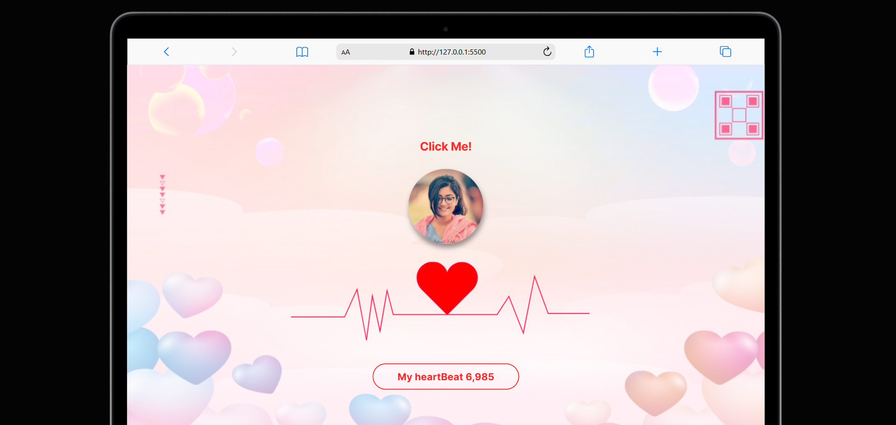

# Heartbeat ❤️  
*A Digital Love Confession Website*  



> **"When code meets 💖... A creative way to confess your feelings through an interactive website!"**  

---

## 🌟 **Features**  
- **Pulsing Heartbeat Animation** (CSS/JS) that mimics a real heartbeat.  
- **Crush’s Photo** displayed elegantly over the animated heart.  
- **"Click Me!" Button** triggers a smooth slide-down confession container.  
- **Secret Message Page** with a heartfelt letter revealed on clicking the 💌 icon.  
- **Infinite Heartbeat Counter** (updates every millisecond) labeled "My Heartbeat".  


## 🛠️ **Installation**  
1. **Clone the repo**  
   ```bash  
   git clone https://github.com/SURAJ1430sv/Love-Confession-Website  
   ```  
2. **just open `index.html` in a browser!**  

---

## 💡 **Customization**  
Make this project **your own**!  
- **Change the photo**: Replace `img/rashiii.jpg` with your crush’s image.  
- **Edit messages**: Modify text in `index.html` (confession, letter, etc.).  
- **Tweak animations**: Adjust CSS in `styles.css` for heartbeat speed/colors.  
- **Add more love**: Extend with music, AI-generated poetry, or AR effects!  

---

## 📚 **Tech Stack**  
- **Frontend**: HTML5, CSS3, JavaScript  
- **Animation**: CSS Keyframes, JS Intervals  
- **Hosting**: Netlify  

---

## 🤝 **Contributing**  
*Love is collaborative!* Feel free to:  
1. Fork the repo 🍴  
2. Create a branch: `git checkout -b feature/your-idea`  
3. Commit changes: `git commit -m 'Added more love'`  
4. Push: `git push origin feature/your-idea`  
5. Open a **Pull Request**!  

**Issues?** Open a GitHub issue tagged as `bug` or `romantic-emergency` 🚨.  

---

## 📜 **License**  
This project is licensed under the MIT License – see [LICENSE](LICENSE) for details.  
*Made with ❤️ Aoudumber Bade*  

---

## 🙏 **Acknowledgements**  
- My crush, for existing.  
- CSS-Tricks for animation inspo.  
- GitHub Copilot for not judging my code.  
- The internet, for letting hearts beat in browsers.  

---

🔗 **Connect with me**:  

[](https://github.com/SURAJ1430sv)  

*"In a world of DMs, I chose DIVs."* 💻❤️  
